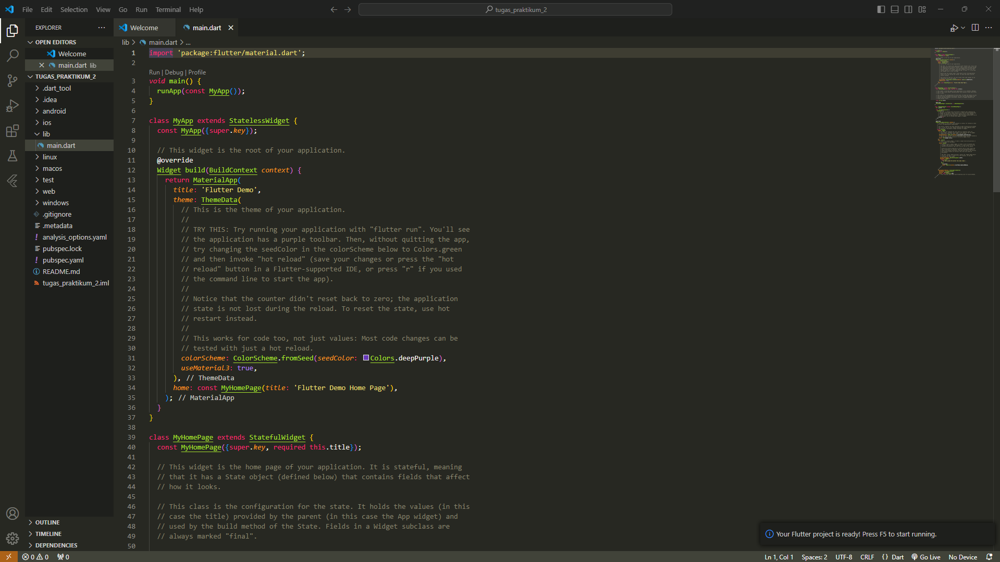
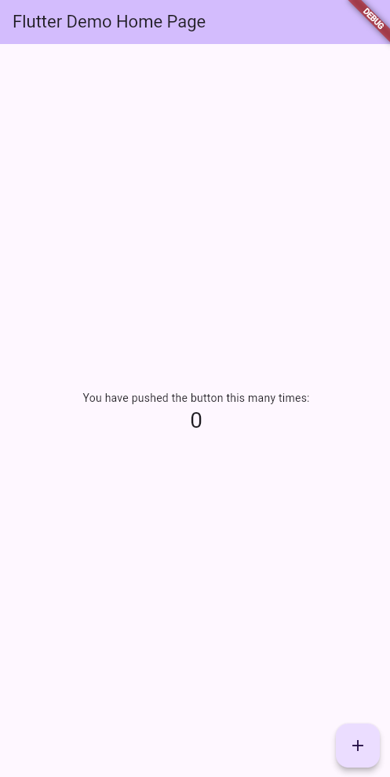
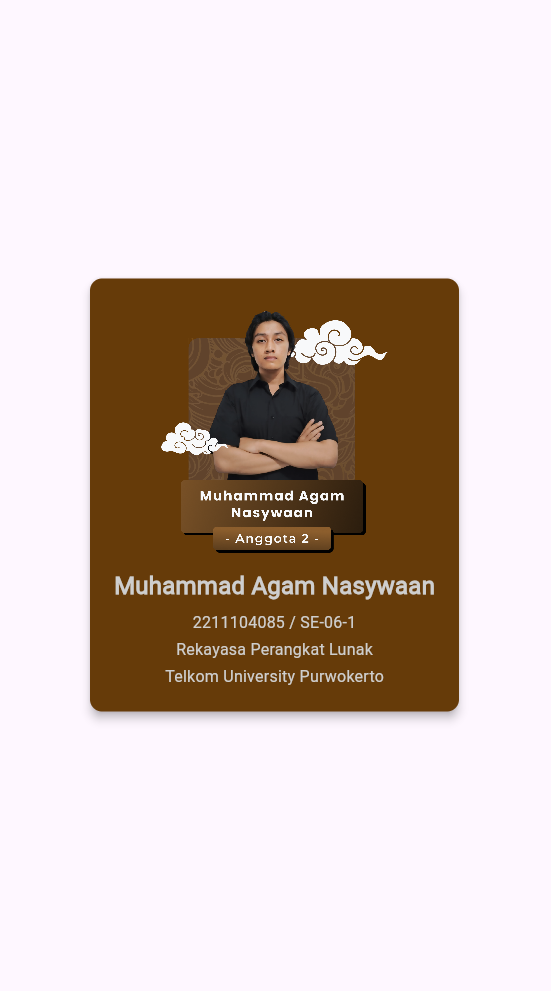

#  Laporan Praktikum Pemrograman Bergerak Pertemuan 2

## Nama : Muhammad Agam Nasywaan
## NIM : 2211104085 / SE-06-1

### 1. Jelaskan apa itu Dart & Flutter beserta contoh widget yang ada pada Flutter
- Dart adalah bahasa pemrograman yang digunakan untuk mengembangkan aplikasi di berbagai platform, seperti Android, IOS, dan Web

- Flutter adalah framework dari bahasa pemrograman Dart

- Widget Flutter : Sacffold, Container, Padding, Margin, Column, Row, Center

### 2. Buatlah sebuah project Flutter

### 3. Jalankan di emulator atau real device

### 4. Biodata
